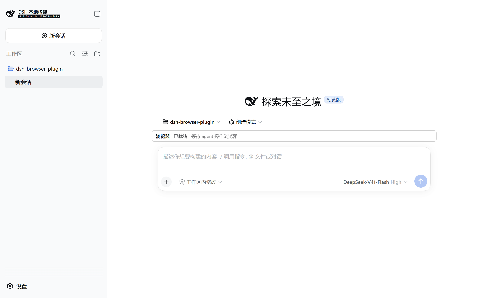
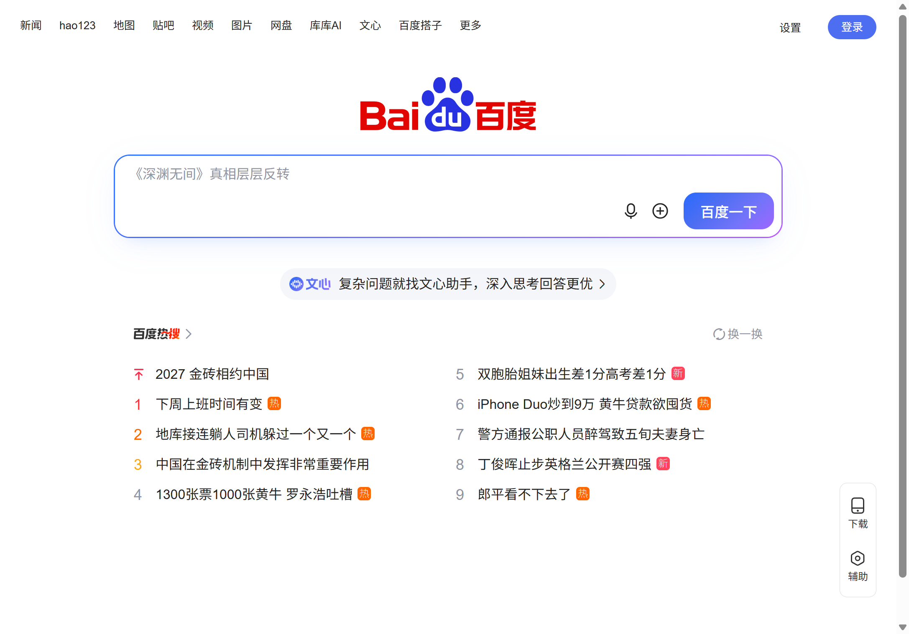

# dsh-webops-plugin

给 [DeepSeek Harness](https://github.com/deepseek-ai/deepseek-harness) 增加**客户端网页操作与调试**能力的插件：
多会话、新窗口、多标签页地调试和操作网页。能力形态对齐 [Minke](https://github.com/lencx/minke) 的 Agent Browser：
模型可以打开页面、读取页面大纲、按 ref 定位并操作元素、采集控制台与网络活动，并支持人工接管。

这是一个 **out-of-tree bundle**：不修改 deepseek-harness 仓库的任何文件，靠自己的 `cordis.patch.yml`
把插件行插进目标 profile。

> 完整设计（Minke 能力基线、dsh 插件机制、分阶段落地、风险与备选方案）见
> `D:\dev\cli\deepseek-harness\.workbuddy\design-browser-plugin.md`。

---

## 状态

**P0（只读）已实现并通过验收。** 模型现在能「看」页面：开标签页、跳转、读可访问性大纲（带 ref）、截图。
四个工具已在真实 profile 上确认进入 agent 的工具视图，不只是配置上插上了（见「接线」一节的实跑验证）。

**桌面端已接入并跑通。** 在**开发态桌面端**（Electron）里实跑通过：host 半边四个面全部加载、客户端半边加载并执行、
观察面板渲染在输入框上方（输入框上方那行「浏览器 · 已就绪」）。见「桌面端接入」一节。

**桌面端里的浏览器窗口是桌面端自己的 Electron 窗口。** 第二个 provider `browser-electron` 让 host 进程
spawn 一个窗口宿主，开真正的 `BrowserWindow`，用它的 `webContents.debugger` 走同一套 CDP 命令。
实测：在**正在运行的桌面端 host 进程里**开出了窗口、跳转、27 个 ref 的大纲、207 KB 截图
（`pnpm run window:desktop`）。见「桌面端：开 Electron 窗口」一节。



| 阶段 | 内容 |
|---|---|
| **P0 只读** ← 已完成 | `ctx.browser` + `browser-cdp` 的 connect / open / navigate / snapshot / screenshot + 4 个只读工具 + ref 纪元 |
| **UI 观察面板** ← 已完成 | `conversation.input.dock` 常驻状态条（含无活动时的「已就绪」态）+ `tool.call.toolview` 四个专属卡片（地址 / 大纲 / 截图） |
| **Electron 窗口 provider** ← 已完成 | `browser-electron`：spawn 窗口宿主 → 真 `BrowserWindow` → `webContents.debugger` 驱动；桌面端默认用它 |
| **P1 操作** ← 已完成 | `browser_tabs`（list/activate/close）+ click / fill / press / scroll / wait + 能力分级（只读 vs 操作）+ `stale_ref` 可重试错误码；fake-llm 脚本扩展为「open → snapshot → tabs+click 同轮双调用」的全链路 keyless 验证 |
| **P2 调试** ← 已完成 | `browser_console` / `browser_network` / `browser_execute` + 3 个错误码 + targetState 簿记骨架 |
| **P3 协作** ← 已完成 | 人工接管（takeover 通道）+ `browser_find` / `browser_locate`（backendNodeId 三守卫） |

### 用法（三步）

```bash
# 1) 起一个带调试端口的 Chrome。必须用**独立的 user-data-dir**，
#    否则会复用你日常那个 Chrome 实例，而它不会开调试端口。
"C:\Program Files\Google\Chrome\Application\chrome.exe" \
  --remote-debugging-port=9333 --user-data-dir="%TEMP%\dsh-cdp-profile"

# 2) 启动 dsh（探针 profile 里已经 link 了本仓，改完源码不必重新 add）
cd /d/dev/cli/deepseek-harness
pnpm dsh --profile browserp0

# 3) 让模型做事，例如：
#    browser_open { "url": "https://example.com" }  → 返回 session_id
#    browser_snapshot { "session_id": "…" }         → 大纲 + ref
#    browser_screenshot { "session_id": "…" }       → 存成 attachment
```

> **端口别用 9222。** 本机 9222 被 dsh 桌面端开发态的 Electron renderer 调试端口占着
> （见「踩过的坑」第 3 条），此时插件会连上那个 Electron 而不是 Chrome，`/json/new` 直接 500。
> 换一个端口（上例用 9333）即可。

## 结构

```
cordis.patch.yml        bundle 的配置层：把五行插进 profile（见下）
package.json            声明 dsh.bundle.patch、dsh.client（客户端双面）、多入口导出
tsdown.config.ts        两条独立产物：host 四面 + 包根（ESM）/ 客户端 bundle（CJS，外裹 __ModuleLoader__）
src/index.ts            包根的 host 半边：**故意是空的**，只为让客户端半边被发现（见「桌面端接入」的坑）
src/debug.ts            加载诊断（写 stdout，桌面端才看得见）
src/browser/            Service Definition —— ctx.browser 服务、provider 选择语义、错误类型
  index.ts                BrowserRuntime（Service）+ DSH_BROWSER_PROVIDER 兜底
  types.ts                会话 / 观察请求 / 错误码
src/browser-cdp/        provider —— 通过 CDP 驱动**外部 Chrome**
  index.ts                插件入口：注册 provider + 卸载时释放资源
  provider.ts             CdpBrowserProvider：会话生命周期、四条操作、截图裁剪
  protocol.ts             CDP 传输层：/json/* HTTP 端点 + WebSocket 命令通道
  refs.ts                 ref 纪元状态机（P0 的核心语义）
  snapshot.ts             可访问性树 → 紧凑大纲 + ref 候选（纯函数）
  url-policy.ts           地址策略：只许 HTTP(S)、禁内嵌凭据、端点是回环
  live.test.ts            对着真实 Chrome 跑的验收测试（没有调试端口时自动跳过）
src/browser-electron/   provider —— 开**桌面端自己的 Electron 窗口**
  index.ts                插件入口：注册 provider（`electron`）+ 启用闸
  provider.ts             ElectronBrowserProvider：复用 CdpBrowserProvider，只换传输层
  bridge.ts               spawn Electron 宿主 + TCP JSON Lines 通道（可注入，单测替换）
  socket.ts               把「桥上的一个窗口」包成 CdpSocket，喂给现成的 CdpConnection
  transport.ts            桥 ↔ CdpTransport 的翻译；句柄 scheme `electron-window://`
  host.cjs                **被 spawn 的 Electron 应用入口**：BrowserWindow + webContents.debugger
  index.test.ts           假通道下的单测（真机行为归 smoke:window）
src/tool-browser/       工具消费者 —— 把能力暴露成 browser_* 工具给模型
  index.ts                browser_open / navigate / snapshot / screenshot / tabs /
                          click / fill / press / scroll / wait + 能力分级 + 系统提示分段
src/client/             浏览器半边（dsh.client）
  index.ts                注册两个 slot 面：conversation.input.dock 与 tool.call.toolview
  BrowserDock.tsx         常驻状态条（无活动时显示「已就绪」）
  BrowserToolRow.tsx      工具的专属卡片（地址 / 大纲 / 截图 / 标签页 / 操作结果）
  observation.ts          从对话快照派生面板状态（纯函数，不 import dsh 客户端类型）
  locales.ts              中英文案
scripts/dev-desktop.mjs   开发态装配进桌面端 profile 并拉起 Electron
scripts/check-desktop.mjs 用 CDP 断言桌面端接入的五项事实
scripts/shot-desktop.mjs  截一张真实桌面端的 PNG
```

为什么不分三个包：官方把能力拆成 `<capability>` / provider / `tool-<cap>` 三包，是为「能力可组合」
（换 provider 不用换工具层）。个人插件不需要这份弹性，单包多入口即可。


## 接进 dsh

### 为什么做成独立仓

| 证据 | 内容 |
|---|---|
| `CONTRIBUTING.md` | 「we cannot accept external pull requests at the moment」——官方现阶段**不收外部 PR** |
| GitHub API | 当前账号对 `deepseek-ai/deepseek-harness` 的权限是 `push: false` |
| `CONTRIBUTING.md` | 官方明确鼓励社区插件：独立建仓 + 给项目打 **`dsh-plugin`** topic 供他人发现 |

往官方仓库 `packages/` 里加代码，只会沉淀成一份永远无法提交的本地工作区——而
`packages/bundle/*/cordis.patch.yml` 与 preset 恰恰是上游每次 release 都会改动的文件，下轮拉取必冲突。

### 开发期

两个方向要通，方向不同、手段不同。

**① 插件仓 → 依赖 dsh 的包**（已配好，`pnpm install` 即可）。

`package.json` 用 pnpm 的 `link:` 协议直接指向本地 checkout，不查 registry：

```json
"@deepseek-ai/cordis": "link:../deepseek-harness/vendor/cordis",
"@deepseek-ai/dsh-tools": "link:../deepseek-harness/packages/core/tools",
"@deepseek-ai/dsh-subprocess": "link:../deepseek-harness/packages/subprocess/subprocess",
"@deepseek-ai/schemastery": "link:../deepseek-harness/vendor/schemastery"
```

这既是绕开 npm 旧版的唯一可行手段（见下节），也让 `pnpm typecheck` 开箱可用。
`link:` 写死了本地相对路径，**发布前要换回 peerDependencies + npm 版本号**。

**② dsh → 加载本插件**（已实测通过）。

一行命令，用官方的 `dsh plugin` 把 checkout link 进 profile：

```bash
cd /d/dev/cli/deepseek-harness
pnpm dsh plugin --profile browserp0 add D:/dev/cli/dsh-webops-plugin
```

它初始化 profile（不存在时）、pnpm link 本目录、并把 `dsh-webops-plugin` 追加进 profile 的
`dsh.profile.bundles`。实测 5 秒完成：

```
dsh: initialized profile browserp0 at C:\Users\yemaf\.dsh\profiles\browserp0
+ dsh-webops-plugin link:D:/dev/cli/dsh-webops-plugin
```

验证层序（应出现 `# == dsh-webops-plugin` 层与五行）：

```bash
pnpm dsh --profile browserp0 --dump-config | grep -A4 "== dsh-webops-plugin"
```

**不需要 junction，也不需要改 dsh 的 `pnpm-workspace.yaml`**——`dsh plugin add` 自己完成了包名解析
所需的那一步。本仓的 `link:` 依赖只负责反方向（插件仓 import 得到 dsh 的包）。

> 已实测：三个入口都能被 dsh 的 tsx 模式加载（`browser` / `browser-cdp` / `tool-browser`），
> 所以 `exports` 指向 `src/*.ts` 源码是可行的。

### 生产期

```sh
dsh plugin --profile <name> add D:\dev\cli\dsh-webops-plugin   # 本地目录
dsh plugin --profile <name> add github:sdegongzuo/dsh-webops-plugin#<sha>  # git（需 prepare + allowBuilds）
```

> git 安装需要本仓提供 self-contained 的 `prepare` 脚本，且用户要在 profile 的 `pnpm-workspace.yaml`
> 里 `allowBuilds: { dsh-webops-plugin: true }`。详见官方 `publish.md`。**待 P0 期间实测**。

### 桌面端另有硬约束（重要，别把两件事混在一起做）

桌面端启动前会跑 `apps/desktop/src/profile-packages.ts` 的 `validateDesktopPluginGraph`，它对
profile 里的插件做四类断言，**每一条都与开发期的 `link:` 路线冲突**：

| 断言（源码位置） | 含义 | 对本仓的影响 |
|---|---|---|
| `linked private package` | profile 的 `node_modules` 下出现 symlink 即拒 | `dsh plugin add` 产生的正是 symlink → **桌面端不吃这条路** |
| `package resolves outside profile` | 依赖闭包必须物理位于 profile 目录内 | 本仓在 `D:\dev\cli\dsh-webops-plugin` → 必须 vendor 一份副本进去 |
| `must declare <host 包> as a peer dependency` | dsh 的共享包只能出现在 `peerDependencies`，出现在 `dependencies` 直接报错 | 本仓现在把 dsh 包放在 `devDependencies` + `link:` → 桌面端会拒 |
| `requires <name>@<range>, found <version>` | peer 版本必须满足范围 | 要跟桌面端 runtime 里的版本对齐 |

结论：桌面端要的是**另一套形态**（真实文件副本 + `peerDependencies` 声明 + 版本对齐）。本仓已经出好这一套，
接入方式见下面的「桌面端接入」小节。桌面端开发态的 `$DSH_HOME` 是
`apps/desktop/.desktop-build/development/home`，profile 是 `apps/desktop/.desktop-build/development/project`。

### 桌面端接入（已打通，三条命令）

```bash
pnpm run build          # 产出 lib/（桌面端只吃构建产物，src/ 不进去）
pnpm run dev:desktop    # 装配进开发态 profile 并拉起 Electron（含 --build 可先跑 dsh 的构建）
pnpm run check:desktop  # 从外部用 CDP 断言「host 认了 / 客户端跑了 / 面板渲染了 / 卡片注册了」
pnpm run shot:desktop   # 截一张真实桌面端的 PNG（docs/desktop-dock.png）
pnpm run window:desktop # 让桌面端 host 进程自己开一个 Electron 窗口（端到端证据）
```

开发态**装插件是被硬禁的**（`apps/desktop/src/main.ts` 里 `plugin package changes require a packaged
application`，且 `plugin-add` 只收 npm registry 形态的 spec），而且 `apps/desktop/scripts/dev.ts` 每次启动都会用
`prepareDevelopmentProject` **整目录重建** `project/`。所以 `scripts/dev-desktop.mjs` 复刻了 dev.ts 的启动序列，
只在中间插一步装配（真实目录复制，不是链接），并且从 dsh 源码直接 import 它的
`prepareDevelopmentProject` / `DESKTOP_HOST_PROTOCOL_VERSION`，**不改动 deepseek-harness 里任何文件**。

#### 这里踩到的坑：客户端行必须是**裸包名**

四个 patch 行里，前三个（`dsh-webops-plugin/browser` 等）负责能力，第四个是**裸包名** `dsh-webops-plugin`，
它的 host 半边是空实现（`src/index.ts`）。原因在 dsh 的
`packages/client/modules/src/index.ts#locatePkgJson()`：它先调 `exactPackageSpecifier(name)` 取包名，而该函数对
**非 scoped 且带 `/`** 的 specifier 直接返回 `undefined`，于是整行被判为「永久不是客户端行」，永远不会去读
`dsh.client` 与 `exports["./client"]`。

也就是说：**带子路径的 host 行不可能带上客户端半边**，客户端两面必须挂在一个裸包名行上。
dsh 自己的纯客户端包（如 `dsh-client-ui-brand-official`）就是这个形态——注释里写得很直白：
「The empty apply gives Loader a host-side row while the browser half ships through exports["./client"]」。

#### 另一个坑：桌面端把 host 的 stderr 吞了

`apps/desktop/src/host-process.ts` 把子进程 stderr 攒在内存里，只在失败时随错误抛出；stdout 才 `pipe` 到
Electron 的 stdout。所以 `src/debug.ts` 的加载诊断**必须写 stdout**——写 stderr 等于什么都没写。
`DSH_BROWSER_PLUGIN_DEBUG=1`（`dev-desktop.mjs` 默认打开）时能看到：

```
[dsh-webops-plugin] root: client row registered
[dsh-webops-plugin] browser-cdp: endpoint=http://127.0.0.1:9333
[dsh-webops-plugin] browser-electron: enabled=true electron=…/electron/dist/electron.exe
[dsh-webops-plugin] tool-browser: registered open, navigate, snapshot, screenshot
```

---

## 桌面端：开 Electron 窗口（`browser-electron`）



### 为什么还需要第二个 provider

`browser-cdp` 连的是**外部** Chrome 的调试端口。桌面端里这条路是死的：

- 桌面端自己的 `--remote-debugging-port`（开发态 9222）就是**它自己的渲染进程**；
- 内置 Chromium 不实现 `PUT /json/new`，实测回一句 `Could not create new page`；
- 桌面端 host 又跑在**纯 Node** 子进程里（`node.exe … dsh-desktop-host/lib/index.js`，不是 Electron），
  所以插件连 `BrowserWindow` 都拿不到，没法自己开窗口。

于是换一条路：host 进程 **spawn 一个 Electron 窗口宿主**（`src/browser-electron/host.cjs`），
窗口由它创建，插件继续用同一套 CDP 命令驱动 —— `Page.navigate` / `Runtime.evaluate` /
`Accessibility.getFullAXTree` / `Page.captureScreenshot` 一个都不用改。
`CdpBrowserProvider` 原样复用，只换传输层（`ElectronWindowTransport`）。

两个 provider 并列注册，用 `DSH_BROWSER_PROVIDER` 选（`dev:desktop` 默认 `electron`）：

| provider | id | 开的是什么 | 谁用 |
|---|---|---|---|
| `browser-cdp` | `cdp` | 外部 Chrome 的标签页 | CLI / 想接自己日常浏览器时 |
| `browser-electron` | `electron` | 真正的 `BrowserWindow` | 桌面端（默认） |

`browser-electron` **默认不参与 provider 选择**（`available()` 有一道启用闸）：不这样做，
`cdp`（端点活着）与 `electron`（二进制找得到）会同时「可用」，`browser` 服务就会
`BROWSER_PROVIDER_AMBIGUOUS`。

### 验证

```bash
pnpm run smoke:window    # 纯 Node 侧：直接驱动 provider 开窗口 → 大纲 → 截图
pnpm run window:desktop  # 端到端：让**正在运行的桌面端 host 进程**自己开窗口
```

`window:desktop` 的实测输出（host 进程就在桌面端里）：

```json
{
  "providerId": "electron",
  "enabled": true,
  "session": { "id": "w1", "url": "https://www.baidu.com/", "title": "百度一下，你就知道" },
  "snapshot": { "epoch": 1, "refs": 27, "chars": 3891 },
  "screenshotBytes": 207285
}
```

它靠桌面端 host 的 inspector（开发态 9230）注入：`Runtime.evaluate` 走
`process.getBuiltinModule('module').createRequire(...)` 把插件产物 require 进来
（inspector 里的 `import()` 会报 *A dynamic import callback was not specified*，
而 Node 22 的 `require()` 认 ESM）。

### 三个必须踩准的时机（全是实测，且都表现为「命令发出去永远不回」）

1. **通道用 TCP，不要用 stdio。** Electron（Windows）主进程的 `process.stdin` 会**立刻 EOF**，
   `on('end')` 一收尾就把 app 关了 —— 症状是「窗口刚建好就自己没了」。
   stdout 是通的，所以反向：宿主监听 `127.0.0.1:0`，把端口从 stdout 宣布。
2. **`debugger.attach()` 要等 `dom-ready`。** 窗口刚 `new` 出来就 attach，`Page.enable` 直接挂住。
3. **建窗口后必须显式 `loadURL()`。** 哪怕加载 `about:blank`：不加载就没有导航，
   `dom-ready` 永远不来，第 2 步就永远等不到。

另外 `CdpSocket` 的 `open` 事件必须是「下一个微任务」派发：`CdpConnection` 的构造是同步的，
`openSocket()` 要先把监听器挂上，派发早了它就错过了。

---
## 依赖版本约束（重要，实测）

| 包 | npm 上 | 本地 checkout | 用途 |
|---|---|---|---|
| `@deepseek-ai/cordis` | 4.0.2 | 4.0.2 | Service / 插件机制 |
| `@deepseek-ai/schemastery` | 3.18.2 | 3.18.2 | `Config` 校验 |
| `@deepseek-ai/dsh-tools` | **0.0.1-rc.1** | 0.1.5-rc.2 | `defineTool`、类型化参数/输出 |
| `@deepseek-ai/dsh-system-prompt` | **0.0.1-rc.1** | 0.1.5-rc.2 | 系统提示分段 |
| `@deepseek-ai/dsh-attachment` | **0.0.1-rc.1** | 0.1.5-rc.2 | 截图落盘（`ImageAttachmentRef`） |
| `@deepseek-ai/dsh-attachment-local` | **0.0.1-rc.1** | 0.1.5-rc.2 | 只在 live 测试里用真实存储 |
| `@deepseek-ai/dsh-subprocess` | **0.0.1-rc.1** | 0.1.5-rc.2 | **P0 未使用**，P1 起用来自动拉起浏览器 |

`@deepseek-ai/dsh-subprocess` 在 P0 里是**刻意留着不用的**：P0 的 provider 只连接用户自己开着的
Chrome，从不启动进程，所以「进程树回收」这一条在 P0 里没有对象可回收（见「验收」第 5 条）。

**dsh 自己的包不要从 registry 装。** 两条实测证据：

1. 版本落后 5 个 minor（`0.0.1-rc.1` vs `0.1.5-rc.2`），类型与接口都对不上。
2. npm 上的 dsh 生态**不完整**：直接 `pnpm install` 会因 `@deepseek-ai/dsh-type-meta` 404 而失败——
   这个包根本没发布。`.npmrc` 里的 `auto-install-peers=false` 挡不住这条链路。

所以 dsh 相关的包一律走 `link:` 指向本地 checkout。**不要**把它们改成 npm 版本号。

## 接线：全部落在 host 平面

`cordis.patch.yml` 的 `insert` 里有五行（前四条 host 行 + 一条裸包名客户端行），都在 host 平面：

| 行 | 说明 |
|---|---|
| `browser` | `ctx.browser` 能力服务，跨会话共享，不能按 preset 分叉 |
| `browser-cdp` | provider（外部 Chrome），注册进 `ctx.browser` |
| `browser-electron` | provider（桌面端自己的 Electron 窗口），默认不参与选择 |
| `tool-browser` | 模型可见的工具 |
| `dsh-webops-plugin`（裸包名） | host 半边是空实现，只为让浏览器那半边被客户端模块表发现；见「桌面端接入」里的坑 |

依据：host 平面的行在**所有** surface（TUI / headless / web / 桌面端）都会生效，除非该 surface 的 overlay
显式 `disabled: true`——这正是 `dsh-web-app` 必须写下 `disabled: true` 才能压掉 `tool-web` 的原因。

**已在源码层核实（不再是推断）**：agent 的 `tools` 视图按 scope 链解析——未加入 preset 的 agent
解析到「空的 global 层」而拿不到任何工具，已加入 preset 的 agent 则同时看到 global 层与 preset 层
（见 `.agents/notes/implemented/architecture/2026-08-10-host-plane-ownership-after-presets.md`）。
这正是 `dsh-web-app` 必须把 base 里**全部 16 个**工具行逐个 `disabled: true` 的原因：不压掉，
host 平面那份就会与 preset 那份一起进入 agent 的工具视图。

所以 host 平面 insert 对四种 surface 都成立：

| surface | base 的工具行 | 本插件的三行 |
|---|---|---|
| headless | 全部 enabled（该 bundle 不禁任何工具行） | enabled → agent 可见 |
| web / 桌面 | 被 `dsh-web-app` 逐个禁用，工具改由 preset 提供 | **不在禁用名单里** → enabled → agent 可见 |
| acp / sdk | 各自的 overlay 只禁 1 行，不涉及工具 | enabled → agent 可见 |

> 若将来上游把工具行整体搬进 preset 并同时禁用 host 平面的一切 `tool-*`，本节结论失效——
> 届时的退路是把该行搬进 `$DSH_HOME/.agent-presets/<preset>/agent.cordis.yml`（preset 是用户资产，可写）。

**已实跑验证（2026-09-12）**：`pnpm dsh --profile browserp0` 真起一次会话后，从会话日志
（`~/.dsh/sessions/<cwd 编码>/<session-id>/session.v3.jsonl.zstd`）里读出来的事实：

- `request/header.tools` 共 **29** 项，其中前四项就是 `browser_navigate` / `browser_open` /
  `browser_screenshot` / `browser_snapshot` —— 工具确实进了发给模型的请求体。
- `request/header.tools[].description` 里，四个工具各自都带着 ref 语义与失效条件
  （`BROWSER_STALE_REF`）以及 untrusted 声明。
- `system/message` 里本插件那个分段文本完整在列（含 `[ref=e12]`、纪元失效、attachment 与
  untrusted 三段）。

即：**host 平面 insert 对 agent 可见这件事，在真实 profile 上已闭环**，上面那张表不再是推断。
会话日志的 `zstd` 需要 `zstd -d -c` 解开；`last` 一条是 `turn/end`。

**patch 语义**：命中某一行时是**整块替换 config**（非深合并），所以覆盖时要重述该行的所有 config 键。

## 实现说明（P0）

### ref 纪元：唯一一件不做就会出错的状态机

一次 snapshot 给页面上每个可操作元素编号。若下一次 snapshot 从 1 重新编号，模型拿着上一次的 `e3`
很可能**命中一个完全不同的元素** —— 这是静默的、最难排查的事故。`src/browser-cdp/refs.ts` 用两条规则
把这个可能性从根上删掉：

1. **序号在会话内单调递增，绝不重置。** 新 snapshot 从上一个纪元的最大值之后继续编号，
   所以「同号不同元素」不可能出现。
2. **解析前先比纪元。** 持有 ref 表的永远只是「当前纪元」那一份；导航与下一次 snapshot 都把整张表换掉。

于是旧 ref 只会落到「表里没有」，报 `BROWSER_STALE_REF`（观察过页面）或 `BROWSER_SNAPSHOT_REQUIRED`
（从未观察过）。两者都是模型该用「重新观察」恢复的错误。P0 里唯一消费 ref 的工具是
`browser_screenshot`（可选的 `ref` 参数，截单个元素）—— 它是只读的，因此**没有**越过 P0 的边界，
却让「旧 ref 必须失败」这条语义有了真实的调用路径，而不是只活在单元测试里。

### 为什么是自己写 CDP 而不是上 Playwright

`src/browser-cdp/protocol.ts` 只做两件事：DevTools 的 `/json/{version,list,new,close}` HTTP 端点，
以及 WebSocket 上的 `{ id, method, params }` 命令通道（约 400 行，含超时、取消、断线结算）。
换来的是零浏览器下载、零 `allowBuilds` 授权、零 Chromium 体积，以及**用户自己的登录态**。
`snapshot.ts` 走可访问性树而不是视觉树 —— 浏览器已经算好了角色与名称，比从布局反推少一个数量级
的代码，对模型也更友好。

### 一次性环境约束

- **`SECTION_ORDERS` 是中央封闭注册表**，外部插件加不了键，只能给 `section({ order: <number> })`
  传显式数字。本插件用 `2050`（紧挨 `TOOL_WEB_SEARCH: 2000` / `TOOL_WEB_FETCH: 2100`）。
- **注册即 effect**：所有贡献走 `ctx.effect()` / `ctx.on()`，`register()` 返回 disposer。
- **插件入口模块不能有 `export default`**（见「踩过的坑」第 1 条）。
- 页面上的一切按**不可信数据**处理，这条同时写进四个工具描述与系统提示分段 —— 只写一处等于没写。

## 验收（P0）

| # | 验收项 | 状态 | 怎么验 |
|---|---|---|---|
| 1 | `--dump-config` 五行在、层序对 | ✅ | `pnpm dsh --profile browserp0 --dump-config \| grep -A5 "== dsh-webops-plugin"` |
| 2 | 真 Chrome 上跑通 open → snapshot → screenshot | ✅ | live 测试（下） |
| 3 | 截图以 attachment 引用出现 | ⚠️ 见下 | live 测试用真实 `LocalAttachmentStore` 存盘；工具层的「图片块」由单测覆盖 |
| 4 | 导航后用旧 ref 拿到 `stale_ref` | ✅ | live 测试 + `provider.test.ts`（并断言**没有**发出截图命令） |
| 5 | 会话关闭后连接释放、无残留 | ✅ | live 测试断言 `close()` 后 `/json/list` 里不再有那个 target |

**第 3 条的边界要说清楚**：`browser_screenshot` 的图确实会以 `ImageAttachmentRef` 形式作为
`{ type: 'image' }` 内容块进入工具结果（单测断言了内容块形状与「base64 不进消息」），
CDP 产出的 PNG 也确实能被真实的 `LocalAttachmentStore` 接受并原样读回（live 测试断言了字节相等）。
**没有**验到的是「在一个真实会话的 UI 里看到这张图」——那需要 `DEEPSEEK_API_KEY` 跑一次真实模型回合，
本机未配置。

**第 5 条的边界**：P0 从不启动浏览器进程（只连接用户已开的 Chrome），所以没有进程树可回收；
「无残留」在这里的准确含义是：WebSocket 全部关闭、由本插件创建的标签页全部关闭。
自动拉起浏览器是 P1 的事，届时才需要 `ctx.subprocess` 的进程树回收语义。

### 手工验收（复制粘贴即可）

```bash
# 0) 起 Chrome（换一个没被占用的端口，本机 9222 被桌面端占着）
"C:\Program Files\Google\Chrome\Application\chrome.exe" \
  --remote-debugging-port=9333 --user-data-dir="%TEMP%\dsh-cdp-profile"

# 1) 对着这个 Chrome 跑全套测试
#    这组只在端点是「真 Chrome」时才跑：9222 上那个 Electron 会被认出来并带原因跳过
cd D:/dev/cli/dsh-webops-plugin
DSH_CDP_ENDPOINT=http://127.0.0.1:9333 pnpm test

# 2) 层序
cd /d/dev/cli/deepseek-harness
pnpm dsh --profile browserp0 --dump-config | grep -A4 "== dsh-webops-plugin"

# 3) 真实会话（需要一个 API key；见下）
#    在容器根建 .env 写入 DEEPSEEK_API_KEY=...（绝不提交），然后：
pnpm dsh --profile browserp0
#    让模型依次调用 browser_open / browser_snapshot / browser_screenshot，
#    即可看到大纲、ref、以及会话里的图片附件。
```

## 开发

```bash
pnpm install       # 工具链 + link 本地 dsh 包；不查 registry
pnpm typecheck     # tsc --noEmit
pnpm test          # vitest；280 个用例通过（另有 3 个 live，端点不是真 Chrome 时整组跳过）
pnpm build         # tsdown 加 copy-assets；产出 lib/（host 四面 + 包根 + 客户端 bundle + host.cjs）
```

测试全部就近放在 `src/**/*.test.ts`（`vitest.config.ts` 的 include 就是这一条）。覆盖：

| 文件 | 覆盖什么 |
|---|---|
| `browser/index.test.ts` | provider 选择语义（7 个错误码）、navigate 转发、dispose 聚合 |
| `browser-cdp/protocol.test.ts` | 命令相关性、CDP 错误映射、断线结算、超时/取消、真 HTTP 端点 |
| `browser-cdp/refs.test.ts` | 纪元推进、序号单调、`stale_ref` / `snapshot_required` |
| `browser-cdp/snapshot.test.ts` | 大纲裁剪、透明层、ref 只给可操作角色、截断、环状树 |
| `browser-cdp/provider.test.ts` | 全链路（含「旧 ref 不发截图命令」与「拒绝新建标签页时不劫持用户页面」） |
| `browser-cdp/url-policy.test.ts` | 地址策略与端点回环约束 |
| `tool-browser/index.test.ts` | 四个工具的 schema 编译、参数校验、输出过 schema、图片块 |
| `browser-cdp/live.test.ts` | 真实 Chrome 上的 open → snapshot → screenshot → navigate → stale_ref → close + 真实 attachment 存储（端点非真 Chrome 时整组带原因跳过） |
| `bundle-patch.test.ts` | **出货 patch 守卫**：`cordis.patch.yml` 里不得出现 `llm/stream` 劫持行、必须在开发 overlay 里保留夹具 |
| `fake-llm/index.test.ts` | 闸门（`DSH_FAKE_LLM` 未开则绝不注册监听器）+ 热搜第五条/ref 抽取的确定性 |

`pnpm-workspace.yaml` 里的 `allowBuilds: { esbuild: true }` 是必需的：pnpm 默认挂起依赖的构建脚本，
vitest 启动前的 deps-status 检查会因此直接失败（`ERR_PNPM_IGNORED_BUILDS`）。

profile 里装的是 **symlink**，所以改完源码不必重新 `add`，直接重跑 `dsh --profile browserp0` 即可。

## 踩过的坑（都是实测）

### 1. 插件入口模块加 `export default` 会静默丢掉 `name` / `inject` / `Config`

`vendor/loader/src/index.ts:194` 是 `exports = exports.default ?? exports`。只要有默认导出，
加载器就用默认导出**替换整个模块命名空间**，于是 `inject` 消失，症状是启动时报
`cannot get property "systemPrompt" without inject` —— 和配置八竿子打不着，很难从错误信息反推。

**规则：插件入口（有 `apply` 的那个模块）不要写 `export default`。**
`src/browser/index.ts` 是例外，它的默认导出就是 `BrowserRuntime` 服务类本身，本来就该是默认导出。
（`pnpm typecheck` 与 `pnpm test` 都发现不了这个问题 —— 只有真的 `dsh --profile` 启动一次才会暴露。）

### 2. patch 行不带 `config:` 时，`apply` 收到的是 `undefined`，不是 schemastery 的默认值

上游 `web-fetch-http` 直接 `config as ResolvedConfig`，是因为它的 patch 行里写了 `config:`。
本插件的行不写 config，所以 `apply` 必须自己 `config: Config = {}` 且每一格都用 `??` 兜底。

### 3. `PUT /json/new` 不是所有 Chromium 都实现

Electron 系的 DevTools 端点（**包括 dsh 桌面端自己**）对 `/json/new` 直接回
`500 Could not create new page`。所以：

- `browser_open` 明确定位为**新建**标签页，不实现「接管既有标签页」的降级 ——
  `/json/list` 里的页面可能是用户的邮箱或 IDE，悄悄接管并导航它比「open 失败」糟得多。
  端点拒绝新建时抛一条带诊断的错误（含当前 page target 数量），指向「换一个真正的 Chrome」。
- **本机 9222 不是空的**：它被 dsh 桌面端开发态的 Electron renderer 调试端口占着
  （`netstat` 显示属主是 `electron.exe`）。此时插件连上的是那个 Electron，`/json/new` 必然失败。
  手工验证请换端口（如 9333）。这也是一个真实的教训：**先确认端口属于谁**，
  别假定 `127.0.0.1:9222` 就是 Chrome。

  这个坑还咬了测试本身：`live.test.ts` 最初只判断 `/json/version` 是否 200，于是 9222 上的
  Electron 让整组「以为」有 Chrome，带着假前提跑完，以两条与实现无关的失败收场。
  现在判定改成读 `User-Agent`：**含 `Electron/` 即视为嵌入式并跳过**——它内部包着的 Chrome
  版本号看不出区别，只认 `Chrome/` 是不够的；跳过时会打印原因（`[live] skipping …`），
  日志里不会只剩一个沉默的 skip。

### 4. 用 `--user-data-dir` 起 Chrome 必须用**新目录**，否则复用已有实例

Chrome 发现同名 user-data-dir 已在运行时，会把 `--remote-debugging-port` 丢掉、直接附着到那个实例。
表现是「端口起不来但不报错」。

## P1 操作交付（2026-09-13）

### 内容

- **`browser_tabs`**：`list` / `activate` / `close` 三个 action。只列本会话自己开的标签页
  （用户的标签页永不出现、永不关闭）；activate 依赖传输层支持，不支持时报
  `BROWSER_NOT_IMPLEMENTED` 而不是静默失败。
- **五个按 ref 的操作工具**：`browser_click` / `browser_fill` / `browser_press` /
  `browser_scroll` / `browser_wait`。全部走 `refs.resolve()` 的**写前检查**：纪元失效
  返回可重试的 `BROWSER_STALE_REF`，从未 snapshot 过返回 `BROWSER_SNAPSHOT_REQUIRED`
  —— 且这两条检查发生在**任何 CDP 页面命令发出之前**（不会先点再查）。
- **导航检测**：click / press 后轮询页面元数据（800ms）；URL 变了就推进纪元并在结果里
  标 `navigated=true`，工具层渲染「所有旧 ref 已失效，请重新 snapshot」。
- **能力分级**：`BROWSER_TOOL_CAPABILITIES` 把 10 个工具分成 `read` / `mutate`，
  作为元数据导出，供策略层（P2 的进度策略、审批面）消费。
- **fake-llm 全链路验证**：脚本第 3 轮同轮发 `browser_tabs(list)` + `browser_click`
  两个工具调用。参数不写死 —— 每轮从请求历史的**非 system 消息**里抽 session_id 与
  最新 ref（系统提示里的 `[ref=e12]` 示例就是第一版误抓的来源，教训：**从消息结构里
  抽，别对整个请求 JSON 做正则**）。

### 实测证据（keyless，headless Chrome @9333）

会话日志四条工具结果全部 `isError=false`：

1. `browser_open` → session_id（ref epoch 0）
2. `browser_snapshot` → epoch 1，`[ref=e1]`
3. `browser_tabs list` → 只列本会话控制的 1 个标签页
4. `browser_click(ref=e1)` → 真实鼠标事件执行，导航被检测到，epoch 推进到 2，
   结果里正确广播「旧 ref 全部失效」

回归：171 通过 + 3 跳过；typecheck 干净；`check:desktop` 的 beacon / dockRegistered /
toolViews=10 三项硬证据通过。

### 已知环境死角（非代码回归）

`check:desktop` 的 `hasDock` 断言在 P1 收尾时失败，根因在桌面端开发环境的 onboarding
死角，与本插件代码无关：桌面 UI 处于 hero 冷启动态（无活动会话），且 workspace 快照为空
—— 此时 `ui-workspace` 的 picker 不渲染菜单，而是直接触发 directory flow，而 Windows 上
该 flow 走**原生目录对话框**（主进程模态，CDP 不可达），自动化无法穿越。dock 的挂载与
卡片渲染本身由 `toolViews=10` 证明（slot 注册成功 + 插件的卡片全部注册），工具真执行由
上面的 headless 会话日志证明。手动过这一关：在桌面 UI 里选一次工作区、开一个会话即可。

### 修正：DevTools 不是互斥（2026-09-13 收尾）

`6a0dc8b` 给窗口宿主加 DevTools 支持时，把「一个 target 只允许一个调试客户端」当成了事实，
于是设计成「人工开 DevTools 前先 `detach` 让位，直到 `devtools-closed` 才接回」—— 等于人工
看 DevTools 的**全程** agent 都是瞎的。

实测推翻了这条：真实约束只是 `openDevTools` 的**调用时机**。调试器还 attach 着时它会
**静默失败**（不抛错，`isDevToolsOpened()` 保持 false）；但 DevTools 打开之后，这个 target
就不再排斥第二个客户端，可以在 `devtools-opened` 回调里直接接回来。

改成「让位 → `openDevTools` → `devtools-opened` 里立刻 re-attach」之后，人工看 DevTools 期间
agent 的 snapshot / 截图 / evaluate 全部照常返回。

- **验证**：`pnpm run smoke:devtools` —— 起真宿主 → 开标签 → 开 DevTools（断言宿主回报
  `isOpen=true`，排除静默失败）→ **断言 `provider.observe(snapshot)` 仍成功** → 关掉 → 再断言。
  另外断言让位只发出**一条** `Inspector.detached`（reason=`devtools-opened`）：Electron 自己
  给的那条 reason 恒为 `target closed`，由宿主的状态位拦下，两条都发只会互相矛盾。
- **顺带修掉一个进程泄漏**：`ElectronBrowserProvider` 之前没有覆盖 `dispose()`，而基类只关
  会话、不关 transport。窗口宿主是本插件自己 spawn 的，不回收的话桥上的 TCP socket 一直活着，
  node 进程就退不掉（修复前该脚本挂 2m45s 被强杀，修复后 13.2s 干净退出）。
- **新增 `devtools` op**：菜单之外的第二条触发路径，让这条行为可被脚本断言；P3 的人工接管会复用它。

## P2/P3 调试与协作交付（2026-09-13）

### 工具（5 个新工具）

| 工具 | 能力级 | 一句话 |
|---|---|---|
| `browser_console` | read | 读会话的 console 环形缓冲（Runtime + Log 两域合流，按 message 高水位去重，最新在前；**默认只给当前文档**） |
| `browser_network` | read | 列网络请求 / 按 requestId 取响应体（Network 事件从不重放，断开窗口期的请求按「会丢」处理；**默认只给当前文档**） |
| `browser_execute` | **mutate** | 白名单制的高危逃生舱：一次发一条允许列表内的 CDP 命令（`Runtime.evaluate` 会执行任意表达式，Promise 会被 await） |
| `browser_find` | read | 在最近一次 snapshot 的大纲上做零状态文本检索，不发任何 CDP 命令 |
| `browser_locate` | read | 按 ref 现算视口坐标盒（backendNodeId 路线）+ `in_viewport`；**默认不动视口**，可选 `Overlay.highlightNode` 高亮 / `scroll=true` 居中 |

### 通用层

- **3+1 个新错误码**（`src/browser/types.ts`）：
  - `BROWSER_DEBUGGER_DETACHED` —— **可恢复**：DevTools 开合期的断连，re-attach 后自动恢复，模型重新采集即可（与 stale ref 刻意区分）；
  - `BROWSER_STATE_CONTENDED` —— 人工持有期间 agent 让渡，错误正文带 `stateKey` / `holder` / `at`；
  - `BROWSER_EXECUTE_RESULT_UNSERIALIZABLE` —— 循环引用 / Symbol / DOM 节点等结果的三态收口，保证工具输出永远是合法 JSON；
  - `BROWSER_EXECUTE_NOT_ALLOWED` —— 命中拒绝列表、或不在允许列表里（默认拒），消息里带被拒 `domain.method` 全文。
- **targetState 簿记骨架**（`src/browser-cdp/state.ts`）：每个 target 一份所有权簿记；owner 为 agent 且值被外部改写、或处于接管窗口内时抛 `BROWSER_STATE_CONTENDED` —— 这是 P3 接管语义的判分依据。
- **takeover 通道**：人工开 DevTools 即触发让位 → `openDevTools` → `devtools-opened` 里立刻 re-attach；此后 snapshot 带 takeover 提示，agent 与人工可同时观察；**ref 纪元不受影响**（DevTools 开合不推进纪元，旧 ref 语义不变）。

### 关键设计约束（各一句）

- **console**：高水位去重 + ≥1000 条环形缓冲，重复刷屏不挤占有效窗口。
- **network**：`Network` 域事件从不重放，调试器断开期间完成的请求就是拿不回来，工具描述明说而非假装兜底。
- **execute**：白名单默认拒 —— 拒绝列表 + 允许列表双向收口，任何未列出的 `domain.method` 一律 `BROWSER_EXECUTE_NOT_ALLOWED`。
- **locate**：backendNodeId 三守卫 —— ① `DOM.resolveNode` 抛错 / 拿不到 objectId → stale ref；② resolve 成功但 `isConnected === false` → stale ref（`replaceWith` 换掉元素后 resolveNode 仍成功，只查一条会漏）；③ rect 宽高为 0 → 协议错误。rect 每次现算，绝不缓存 snapshot 时的几何。
- **高亮**：只用 `Overlay.highlightNode`，绝不用 `highlightRect`（后者会把传入 rect 之外的整个视口都罩住）。

### 验证与设计依据

回归以 `pnpm test` 的输出为准（273 passed / 3 skipped，3 个 live 用例在端点非真 Chrome 时整组跳过）。
P2/P3 的设计依据见 `docs/P2-P3-开发方案.md` 与 `docs/P2-P3-状态归属与接入规范.md`。

## 五个典型场景实测的修复（2026-09-14）

来源：`docs/browser-tools-five-scenarios.md`（真 Electron 窗口、无 fake-llm、无 API key 的实测报告）。
9 条问题逐条修完，每条都有对应的回归测试。

| # | 修法 | 落点 |
|---|---|---|
| 1 | 检测到导航后再等新文档可用（标题出现 / `readyState=complete`，上限 5s），`press` 不再返回空 title | `provider.detectNavigation` → `settleDocument` |
| 2 | `browser_snapshot` 支持 `max_lines`（≤5000，字符预算按行数同步放大）；截断时如实报「截到第几行 + 少给多少元素」 | `snapshot.resolveSnapshotLimits`、`formatSnapshotOutput` |
| 3 | `browser_locate` **默认不滚视口**（`scroll` 默认 false），并回 `in_viewport` —— 于是 locate 能用来验证 scroll 是否生效 | `provider.locate`、`tool-browser` |
| 4 | `browser_scroll` 的 `ref` 变可选：不给就落在视口中心（整页滚动），不再要求先 snapshot | `provider.scroll` → `viewportCenter` |
| 5 | 零 ref 的页面在 snapshot 结果里显式说明「没有可操作元素」并给出替代动作 | `formatSnapshotOutput` |
| 6 | 时间戳不再写死单位，按量级归一（秒/毫秒/微秒 → 毫秒）；修掉 Runtime 比 Log 小 1000 倍 | `console.normalizeTimestamp` |
| 7 | `Runtime.evaluate` 强制 `awaitPromise`；`exceptionDetails` 取真实异常文本；不可序列化消息说明「表达式已执行、副作用不回滚」 | `provider.execute`、`execute.ts` |
| 8 | console / network 记录带文档序号，读/列默认只给当前文档并如实报 `earlier_documents`；`all_documents=true` 可读全部（过滤不等于丢弃） | `console.ts` / `network.ts` / `provider.noteDocumentChange` |
| 9 | 空标题、零 ref 都有明确提示（不再是空白或沉默） | `formatSessionOutput` / `formatSnapshotOutput` |

## 发版

两条链路各自吃一种 tag，互不干扰：

### 插件便携版 —— `v*` tag

`.github/workflows/release.yml`：windows-latest 上取 deepseek-harness 源码
（13 个 `link:` 依赖指向它）→ `pnpm install` → `pnpm build` → 打 zip → 建 Release。
也支持 Actions 手动补发（`workflow_dispatch`，可覆盖 `harness_ref`）。

产物 `dsh-webops-plugin-v<ver>-win-x64-portable.zip` 是**免构建**的插件目录：解压后
`dsh plugin add <目录>` 直接加载，用户端不需要 Node 工具链，也不需要 harness checkout
（发布版 `package.json` 已剔除 `devDependencies` 里的 `link:`）。包内 `INSTALL.md` 有完整步骤。

```bash
pnpm run package:portable            # 本地也能打，产出 dist/*.zip
git tag v0.1.0 && git push origin v0.1.0
```

> 便携版的「win-x64」体现在**命名与验证环境**上：产物本身是平台无关的 JS + 一个
> Electron 窗口宿主 `lib/browser-electron/host.cjs`（运行时由桌面端提供 electron.exe）。

### 桌面端便携版（含插件的整个 dsh）—— `desktop-v*` tag

`.github/workflows/release-desktop.yml`：取 harness → **打补丁** → 装依赖 → 修 electron-builder
的 EPERM → `package:win:x64:dir --unsigned` → 物化插件 profile → 打 zip → 建 Release。
约 226 MB，CI 要 1–3 小时（job timeout 180 分钟）。

```bash
git tag desktop-v0.2.0 && git push origin desktop-v0.2.0
```

**harness 侧必须打补丁才能过，补丁在本仓 `docs/harness-desktop-build.patch`**，
`git apply --ignore-whitespace` 干净应用（已在 pin 的 `c291e79` 上验证过）：

| 补丁点 | 为什么 |
|---|---|
| 去掉 `install --prod --frozen-lockfile --trust-lockfile` 的 `--frozen-lockfile` / `--trust-lockfile` | 这组标志下 pnpm 卡在 `added 241/507` 且 `download` 恒为 0（换 registry 也不动），去掉后同一项目 21.5 秒装完 |
| 跳过 `runtime-payload-smoke.mjs` 的 `checkFsExt()` | `fs-ext` **不在**当前版本依赖树里（多个 tarball、lockfile、产物 `node_modules` 全都没有），`require` 必然 `MODULE_NOT_FOUND` —— 不是编译失败，是没被安装 |

补丁只改 CI 里的临时 checkout，不污染本地 harness。另一个坑在 `scripts/patch-electron-builder.mjs`：
electron-builder 解包完立即 rename，Windows 上因句柄未释放报 EPERM，加了个重试。

> **不需要 Visual C++ 构建工具**：node-pty 用预编译的 conpty.dll，koffi / sharp 同理，实测没有编译过原生模块。

#### 坑：profile 光写 `package.json` 不够，插件会被静默抹掉

`scripts/package-desktop-portable.mjs` 手工物化 `home/profiles/desktop/`。但只写
`package.json`（登记 `dependencies` + `dsh.profile.bundles`）**不能生效**：

`DesktopProjectManager.applyRelease()`（`apps/desktop/src/project-manager.ts:306`）第一步是
`previous = readDesktopProfileState(profile)`，读的是 profile 下的 `desktop-runtime-state.json`；
`previous === undefined`（文件不存在）时它会调 `createPluginProfile()`，而那个函数
（同文件 `:604`）把 `package.json` **整个重写**成 `dependencies: {}` +
`bundles: [@deepseek-ai/dsh-base, @deepseek-ai/dsh-web-app]` —— 登记的插件被冲掉，
接着 `prepareProfile()` 拿空的 activePlugins 校验，直接返回，**不报错、不提示**。
表现就是：双击启动、界面正常、什么插件都没有。

所以打包脚本会额外写一份 `desktop-runtime-state.json`，三个取值有硬约束：

| 字段 | 约束 | 踩错的后果 |
|---|---|---|
| `nodeVersion` / `platform` / `arch` | 必须与 `app/resources/dsh/desktop-runtime.json` 完全一致 | 不一致 → `reconcileProfile` 判定 `rebuild=true` → **删掉整个 `node_modules`** 再跑 `pnpm install --frozen-lockfile`（插件不在 registry，必挂） |
| `runtimeId` | `sha256(JSON.stringify(descriptor))`，键序照抄 `runtime-tree.ts:150` 的构造 | 不一致 → **起宿主之前** `assertProfileRuntime`（`main.ts:204`）就抛 `profile does not match this application runtime`，用户看到的是启动错误页（**不是无害的**，2026-09-14 实测纠正了先前「只是走不到快速返回分支」的误记） |
| `links` | 给 `[]` | 真实 junction 的 target 是**用户机器上的绝对路径**，打包时无从得知；给空数组让桌面端自己建链并回写 |

校验这三条不靠肉眼：`pnpm run verify:portable` 会用 harness 真代码（`readDesktopRuntime` +
`desktopRuntimeId`）重算一遍并逐项对照。

> 这个坑 v0.1.0 和 v0.2.0 都有 —— 两个包发出去后插件都没加载过，因为从来没人真的双击起过它。

#### 坑：keyless 验证夹具 `fake-llm` 曾经随包发出去

v0.2.0 的 `cordis.patch.yml` 里带着 `fake-llm` 行。它**不是**一个无害的调试开关：

```js
ctx.on('llm/stream', (options, _next) => { /* 直接 return 自己的流，从不调 _next() */ })
```

`llm/stream` 在 dsh 里是 **waterfall**（`dsh-llm/lib/index.js`：`ctx.waterfall(this, 'llm/stream', options, () => this.adapterStream(...))`），
监听器只要不调 `next()` 就短路掉真实模型。所以装了 v0.2.0 的用户，**任何真实对话都会被换成
「打开百度 → 读热搜第五条」的脚本回放**。（对照官方写法的正确姿势：`dsh-llm/lib/invariant.js:63`
的 `(_options, next) => validateStream(next(), fail)` —— 它调了 `next()`。）

现在这三道防线同时存在：

| 防线 | 位置 |
|---|---|
| 那一行不在出货 patch 里 | `cordis.patch.yml`（随 `package.json#files` 进便携版） |
| 开发/验证专用 overlay 单独一个文件，且不在出货白名单 | `cordis.fake-llm.patch.yml`（由 `dev-desktop.mjs` 拼接写进开发态 profile） |
| `apply` 有闸门，默认哑 | `src/fake-llm/index.ts` 的 `GATE_ENV = 'DSH_FAKE_LLM'`，只有 `=1` 才注册监听器 |

`src/bundle-patch.test.ts` 会把前两条钉死在 `pnpm test` 里（它按 YAML 有效行断言，注释里
解释「为什么不在」不会误伤自己）。

#### 发版前必做：`pnpm run verify:portable`

上面两个坑**都不会**被 `pnpm typecheck` / `pnpm test` / CI 构建拦住 —— 那一行是合法配置，
插件也是合法加载。所以发便携版之前必须真的把**打包产物**起一次：

```bash
# 1) 解压便携版（zip 解开，或 CI 产出的目录）
# 2) 自检（先用 harness 真代码走桌面端启动准备，再真起宿主读 boot graph）
pnpm run verify:portable -- --dir /path/to/解压后的目录
# 3) 想在真浏览器里再确认客户端注册，就多给一个 Chrome：
pnpm run verify:portable -- --dir /path/to/解压后的目录 \
    --browser "C:/Program Files/Google/Chrome/Application/chrome.exe"
```

`--harness` 指向 deepseek-harness 源码（默认 `$DSH_HARNESS` 或 `D:/dev/cli/deepseek-harness`），
前几条断言靠它的 `apps/desktop/src/*.ts` 真代码 —— 不是脚本自己复刻的逻辑。

它分两段：**先把桌面端的启动准备走一遍**（`readDesktopRuntime` → `desktopRuntimeId` →
`verifyDesktopRuntime` → `linkDesktopHostPackages` → `validateDesktopPluginGraph`，
即 Electron 里 `applyRelease()` 串起来的那几步）；**再复刻 Electron 壳对宿主做的前两件事**
（给 fd3/fd4 管道、转发 `dsh-app://app/*` 请求）。拿到的 `/index.html` 与真启动同源，
验证的是**产物本身**：

| 断言 | 挡住的失败 |
|---|---|
| `app/resources/dsh` 全量 sha256 对齐 `desktop-runtime.json#files` | 解压损坏 / 打包截断 |
| `state.runtimeId` 与本包 runtime 一致 | 起宿主前被 `assertProfileRuntime` 拦到错误页 |
| `state.nodeVersion` / `platform` / `arch` 与 runtime 一致 | `reconcileProfile` 走 `rebuild` → `pnpm install --frozen-lockfile` → 插件不在 registry，必挂 |
| 能建出 241 条宿主链接，且 `validateDesktopPluginGraph` 通过 | 插件依赖没本地化 / 共享宿主实例被顶替 / peer 版本不满足 |
| 出货 patch 里没有 `llm/stream` 劫持行、profile 里没有越权 overlay | `fake-llm` 这类夹具随包出货 |
| `desktop-runtime-state.json` 在位、无遗留 `desktop-packages-pending` | 插件登记被 `createPluginProfile` 静默抹掉 |
| `__DSH_BOOT__` 里有插件的客户端行，bundle 能 200 拉取且是合法客户端模块 | 客户端半边没被发现 |
| 给了 `--browser` 时 `<html>` 信标 `dshBrowserPluginDock≥1`、`dshBrowserPluginToolViews≥15` | bundle 拉到了但注册失败 |

脚本在 profile 的**工作副本**上建链，不动 `--dir` 里那份，所以可以反复跑（每次都从出厂态验）。

> 它**不断言状态条出现在 DOM 里**：状态条挂在会话面的 `conversation.input.dock` 上，而
> `ui-conversation` 只在会话存在时才渲染那个 slot（`const zone = session === undefined ? undefined : {…}`）——
> 空 home 会停在「选择工作区」页，那一面根本没挂载。这是**预期行为**，不是插件没加载
> （2026-09-14 就是在这里误会过一次：用户还没选工作区，以为插件没装上）。

##### 自检本身踩过的坑：解压产物损坏会被误读成「包坏了」

2026-09-14 对便携版真包做自检时，`runDesktopHost` 报
`Cannot find package '@deepseek-ai/dsh-client-ui-workflow-run'`，看着像包不完整 —— 其实是
**解压那一步坏了**：`D:/tmp/dsh-v021-run` 的 14071 个文件里 **5160 个是 NUL 填充**
（大小对、内容全 `\x00`；`使用说明.txt`、`dsh-desktop-host/lib/index.js` 全中招），
而 zip 自己的 CRC 校验 **11954 个条目全绿**。

所以第一条断言就是全量 sha256 —— 它把「包到底好不好」变成证据，而不是靠「起不来 → 包坏了」猜。
再遇到同类报错，先验 zip（`python -c "import zipfile;print(zipfile.ZipFile(p).testzip())"`），
再验解压产物；**换一种解压方式**即可（Python 的 `zipfile.read()` 逐条写盘是好的）。

另：**出厂态 `profile/node_modules` 只有 `dsh-webops-plugin` 一个条目**是正常的 ——
241 条 `@deepseek-ai/*` 链接由桌面端首次启动时 `linkDesktopHostPackages` 建立，
zip 里没有它们、`state.links` 是空数组，**这是设计如此**（链接目标在用户机器上无从预知）。

## License

MIT
