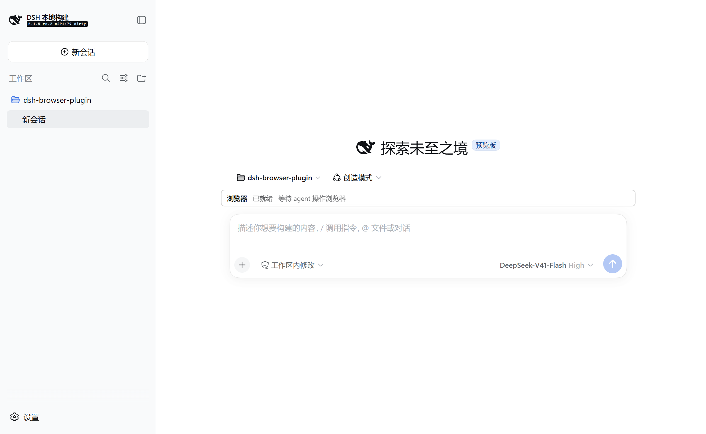

# dsh-webops-plugin

为 [DeepSeek Harness](https://github.com/deepseek-ai/deepseek-harness) 提供网页操作与调试：独立浏览器窗口、多标签、可访问性快照、ref 操作、控制台与网络采集，以及人工接管。

插件在自己的仓库维护，通过 cordis.patch.yml 接入 profile。桌面端默认使用 Electron provider；外部 Chrome 使用 CDP provider，出厂配置默认关闭，启用方式见安装说明。

## 安装与更新

从 [GitHub Releases](https://github.com/sdegongzuo/dsh-webops-plugin/releases) 按使用方式选择产物：

| 使用方式 | 产物 | 操作 |
|---|---|---|
| 首次使用桌面端 | dsh-webops-desktop-v&lt;插件发布版本&gt;-win-x64-portable.zip | 解压后运行启动.cmd |
| 更新已有插件 | dsh-webops-plugin-v&lt;版本&gt;.zip | 完全退出后覆盖到实际插件目录，再重启 |
| 已有自己的 dsh | dsh-webops-plugin-v&lt;版本&gt;.zip | 按 [插件安装说明](docs/portable-install.md) 装入 profile |

每次发布同时提供完整便携包与独立插件包；已有用户可以只替换插件。完整包内置 WebOps、Context 与 Better Sidebar 三个插件，release-manifest.json 分别记录插件和 DSH 本体版本。下载后核对 SHA256；插件版本取插件目录中的 package.json。

## 工具与权限

| 工具 | 用途 |
|---|---|
| webpage_open / webpage_navigate | 新开受控标签、导航或历史前进后退 |
| webpage_snapshot / webpage_find | 读取页面大纲和检索缓存；区域参数为 region_ref、region_viewport、region_box，三者互斥 |
| webpage_revalidate / webpage_locate | 恢复旧 ref、取得实时坐标 |
| webpage_click / fill / press / scroll | 操作元素，执行前检查 ref 与页面状态 |
| webpage_wait | 等文本、元素消失、页面稳定或指定时间；生成回复优先等待当前回复的完成标记 |
| webpage_screenshot / console / network | 截图与调试采集 |
| webpage_tabs | 查看持有/空闲标签、激活、关闭、领取、释放与移交 |
| webpage_execute | 用 session_id、code 和可选 timeout_ms 执行一次 async 函数体；用 return 返回普通数据，用 await 等待结果 |

每个受控标签同时最多由一个对话占用；弹窗继承家族归属。释放保留页面，移交使用一次性码。人工接管期间 agent 不能操作，交还后重新取得有效 ref。重启不会恢复旧对话权限。页面内容按不可信数据处理。

## 开发与验证

先读 [AGENTS.md](AGENTS.md)，本机路径配置使用 .env.local 与 scripts/local-env.mjs。日常命令、Chrome live 测试和开发态联调见 [开发指南](docs/开发指南.md)。构建、暂存与测试证据放 D 盘；脚本是否删除或覆盖文件必须执行前核对。

发布步骤与门禁见 [打包与发版](docs/打包与发版.md)。Release 附件存在和 Actions 成功分别核对，报告同时包含两者。

## 文档导航

| 任务 | 文档 |
|---|---|
| 改实现或排查模块 | [架构与实现](docs/架构与实现.md)、[CDP 实测事实](docs/CDP实测事实.md) |
| 维护对话标签归属 | [多会话方案](docs/多会话防冲突-实施方案.md) |
| 改点击、浮层、导航和 execute | [网页交互方案](docs/webpage交互改进-实施方案.md) |
| 优化工具描述、快照与上下文预算 | [上下文方案](docs/上下文膨胀-实施方案.md)、[测量口径](docs/上下文膨胀-测量口径.md) |
| 运行真实工具场景 | [用户故事](docs/用户故事与实测场景.md)、[打包态对话驱动](docs/打包态对话驱动.md) |
| 查看版本验证结果与限制 | [验收记录](docs/验收记录.md) |

## License

MIT
